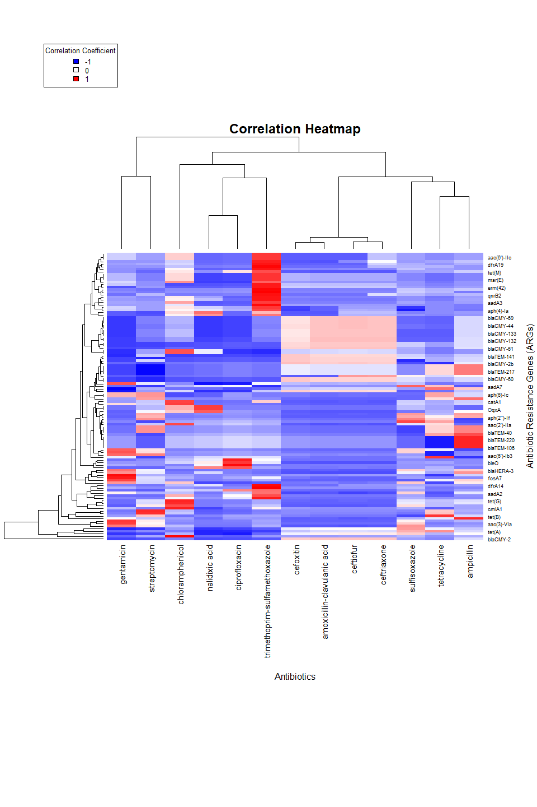

Correlation Analysis
================
Geovanny Risco
May 30, 2023

- <a href="#1-import-libraries" id="toc-1-import-libraries">1 Import
  libraries</a>
- <a href="#2-read-data" id="toc-2-read-data">2 Read data</a>
- <a href="#3-correlation-analysis" id="toc-3-correlation-analysis">3
  Correlation analysis</a>

# 1 Import libraries

``` r
library(tidyverse)
```

    ## Warning: package 'tidyverse' was built under R version 4.1.3

    ## -- Attaching packages --------------------------------------- tidyverse 1.3.2 --
    ## v ggplot2 3.4.1     v purrr   1.0.1
    ## v tibble  3.1.8     v dplyr   1.1.0
    ## v tidyr   1.3.0     v stringr 1.5.0
    ## v readr   2.1.4     v forcats 1.0.0

    ## Warning: package 'ggplot2' was built under R version 4.1.3

    ## Warning: package 'tibble' was built under R version 4.1.3

    ## Warning: package 'tidyr' was built under R version 4.1.3

    ## Warning: package 'readr' was built under R version 4.1.3

    ## Warning: package 'purrr' was built under R version 4.1.3

    ## Warning: package 'dplyr' was built under R version 4.1.3

    ## Warning: package 'stringr' was built under R version 4.1.3

    ## Warning: package 'forcats' was built under R version 4.1.3

    ## -- Conflicts ------------------------------------------ tidyverse_conflicts() --
    ## x dplyr::filter() masks stats::filter()
    ## x dplyr::lag()    masks stats::lag()

# 2 Read data

``` r
args_data_cleaned_path <- "data/results/resfinder/args_data_latest_cleaned.tsv"
args_data <- read_tsv(args_data_cleaned_path)
```

    ## Rows: 6208 Columns: 145
    ## -- Column specification --------------------------------------------------------
    ## Delimiter: "\t"
    ## chr   (1): sample_name
    ## dbl (144): aac(3)-IId, aac(3)-VIa, aac(6')-Iaa, aadA1, aadA2, aadE-Cc, ant(2...
    ## 
    ## i Use `spec()` to retrieve the full column specification for this data.
    ## i Specify the column types or set `show_col_types = FALSE` to quiet this message.

``` r
amr_labels_cleaned_path <- "data/results/data_collection_ncbi/amr_labels_latest_cleaned.tsv"
amr_labels <- read_tsv(amr_labels_cleaned_path)
```

    ## Rows: 6207 Columns: 14
    ## -- Column specification --------------------------------------------------------
    ## Delimiter: "\t"
    ## chr  (1): SampleID
    ## dbl (13): amoxicillin-clavulanic acid, ampicillin, cefoxitin, ceftiofur, cef...
    ## 
    ## i Use `spec()` to retrieve the full column specification for this data.
    ## i Specify the column types or set `show_col_types = FALSE` to quiet this message.

# 3 Correlation analysis

In the next section we will perform a correlation analysis between the
different variables in the dataset and the multiple antibiotics.

``` r
# Prepate data for correlation analysis: Remove null values and sort data in same order
arranged_amr_labels <- amr_labels %>%
    drop_na() %>%
    arrange(SampleID)
arranged_args_data <- args_data %>%
    filter(sample_name %in% arranged_amr_labels$`SampleID`) %>%
    arrange(sample_name) %>%
    select(-sample_name) %>%
    select_if(function(x) any(x != 0))
arranged_amr_labels <- arranged_amr_labels %>%
    select(-`SampleID`)

# Calculate correlation matrix and its p-values
args_correlation_matrix_coefficients <- matrix(NA, nrow = ncol(arranged_args_data), ncol = ncol(arranged_amr_labels), dimnames = list(colnames(arranged_args_data), colnames(arranged_amr_labels)))
args_correlation_matrix_pvalues <- matrix(NA, nrow = ncol(arranged_args_data), ncol = ncol(arranged_amr_labels), dimnames = list(colnames(arranged_args_data), colnames(arranged_amr_labels)))
for (i in 1:ncol(arranged_args_data)) {
    for (j in 1:ncol(arranged_amr_labels)) {
        args_correlation_matrix_coefficients[i, j] <- cor.test(arranged_args_data[[i]], arranged_amr_labels[[j]])$estimate
        args_correlation_matrix_pvalues[i, j] <- cor.test(arranged_args_data[[i]], arranged_amr_labels[[j]])$p.value
    }
}

# TODO: analyze p-values to see if they are significant
# args_correlation_matrix <- cor(arranged_args_data, arranged_amr_labels) # Alternative method to calculate correlation matrix with coefficients but not p-values
```

``` r
# heatmap of correlation matrix
heatmap(args_correlation_matrix_coefficients,
    xlab = "Antibiotics", ylab = "Antibiotic Resistance Genes (ARGs)",
    main = "Correlation Heatmap",
    col = colorRampPalette(c("blue", "white", "red"))(100),
    key = TRUE,
    key.title = "Correlation Coefficients",
    # Separate axis a bit more
    margins = c(16, 6)
)
```

    ## Warning in plot.window(...): "key" is not a graphical parameter

    ## Warning in plot.window(...): "key.title" is not a graphical parameter

    ## Warning in plot.xy(xy, type, ...): "key" is not a graphical parameter

    ## Warning in plot.xy(xy, type, ...): "key.title" is not a graphical parameter

    ## Warning in title(...): "key" is not a graphical parameter

    ## Warning in title(...): "key.title" is not a graphical parameter

``` r
# Add gradient color legend
legend("topleft",
    legend = c("-1", "0", "1"),
    fill = colorRampPalette(c("blue", "white", "red"))(3),
    title = "Correlation Coefficient",
    cex = 0.8
)
```

<!-- -->
