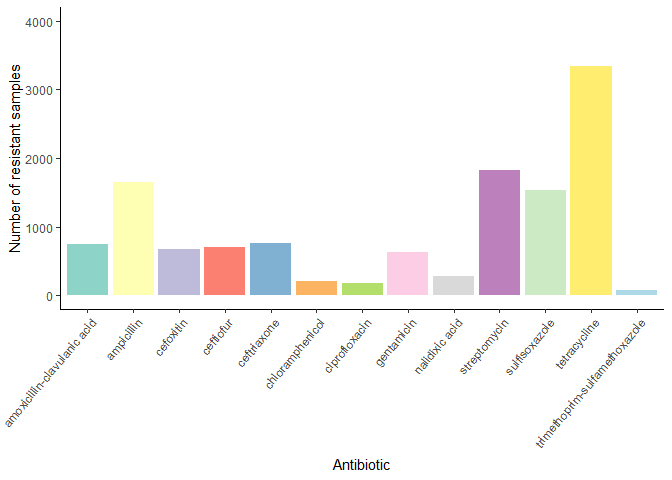
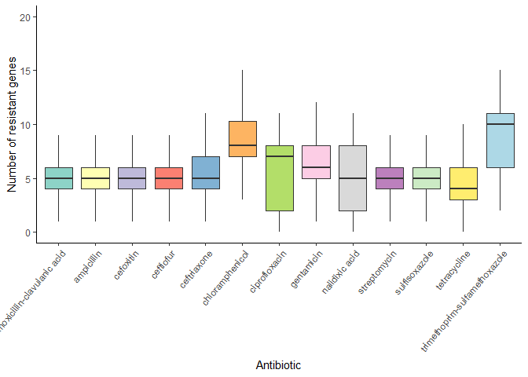
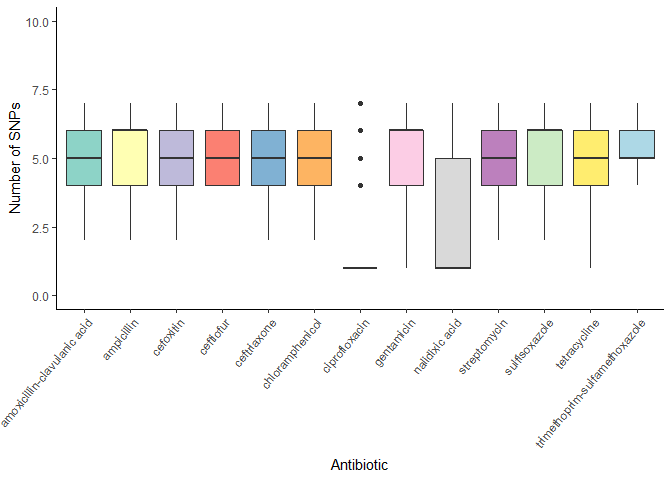

Data Cleaning
================
Geovanny Risco
June 06, 2023

- <a href="#1-import-libraries" id="toc-1-import-libraries">1 Import
  libraries</a>
- <a href="#2-constantconfig-variables"
  id="toc-2-constantconfig-variables">2 Constant/Config variables</a>
- <a href="#3-import-data" id="toc-3-import-data">3 Import data</a>
- <a href="#4-clean-and-prepare-data" id="toc-4-clean-and-prepare-data">4
  Clean and prepare data</a>
  - <a href="#41-args-from-resfinder" id="toc-41-args-from-resfinder">4.1
    ARGs from Resfinder</a>
    - <a href="#411-overview-of-the-data"
      id="toc-411-overview-of-the-data">4.1.1 Overview of the data</a>
    - <a href="#412-null-values-detection"
      id="toc-412-null-values-detection">4.1.2 Null values detection</a>
    - <a href="#413-outliers-detection" id="toc-413-outliers-detection">4.1.3
      Outliers detection</a>
    - <a href="#414-feature-engineering"
      id="toc-414-feature-engineering">4.1.4 Feature engineering</a>
  - <a href="#42-snps-from-card" id="toc-42-snps-from-card">4.2 SNPs from
    CARD</a>
    - <a href="#421-filtering" id="toc-421-filtering">4.2.1 Filtering</a>
    - <a href="#422-explorationvisualization"
      id="toc-422-explorationvisualization">4.2.2
      Exploration/Visualization</a>
    - <a href="#423-preparation" id="toc-423-preparation">4.2.3
      Preparation</a>
  - <a href="#43-amr-labels" id="toc-43-amr-labels">4.3 AMR labels</a>
    - <a href="#431-preparation" id="toc-431-preparation">4.3.1
      Preparation</a>
    - <a href="#432-cleaning" id="toc-432-cleaning">4.3.2 Cleaning</a>
    - <a href="#433-exploration" id="toc-433-exploration">4.3.3
      Exploration</a>
- <a href="#5-explore-data" id="toc-5-explore-data">5 Explore data</a>
- <a href="#6-save-data" id="toc-6-save-data">6 Save data</a>

# 1 Import libraries

``` r
library(tidyverse)
```

    ## Warning: package 'tidyverse' was built under R version 4.1.3

    ## -- Attaching packages --------------------------------------- tidyverse 1.3.2 --
    ## v ggplot2 3.4.1     v purrr   1.0.1
    ## v tibble  3.1.8     v dplyr   1.1.0
    ## v tidyr   1.3.0     v stringr 1.5.0
    ## v readr   2.1.4     v forcats 1.0.0

    ## Warning: package 'ggplot2' was built under R version 4.1.3

    ## Warning: package 'tibble' was built under R version 4.1.3

    ## Warning: package 'tidyr' was built under R version 4.1.3

    ## Warning: package 'readr' was built under R version 4.1.3

    ## Warning: package 'purrr' was built under R version 4.1.3

    ## Warning: package 'dplyr' was built under R version 4.1.3

    ## Warning: package 'stringr' was built under R version 4.1.3

    ## Warning: package 'forcats' was built under R version 4.1.3

    ## -- Conflicts ------------------------------------------ tidyverse_conflicts() --
    ## x dplyr::filter() masks stats::filter()
    ## x dplyr::lag()    masks stats::lag()

# 2 Constant/Config variables

``` r
batch_number <- "_batch3"
MAX_NULLS_PER_ANTIBIOTIC <- 30 # In percentage
```

# 3 Import data

``` r
# ARGs (Antibiotic Resistance Genes)
args_data_filepath <- paste0("data/results/resfinder/args_table", batch_number, ".csv")
args_data <- read_csv(args_data_filepath, col_types = cols("sample_name" = col_character()))
## Fix/extract name of samples
args_data <- args_data %>%
  mutate(sample_name = str_extract(sample_name, "^\\w+.\\d+"))
args_data
```

    ## # A tibble: 6,306 x 162
    ##    sample_name    NarA  NarB aac(3~1 aac(3~2 aac(6~3 aac(6~4 aadA1 aadA2 aadE-~5
    ##    <chr>         <dbl> <dbl>   <dbl>   <dbl>   <dbl>   <dbl> <dbl> <dbl>   <dbl>
    ##  1 GCA_01263718~     0     0       0       0       0       0     0     0       0
    ##  2 GCA_01263728~     0     0       0       0       0       0     0     0       0
    ##  3 GCA_01263731~     0     0       0       0       0       0     0     0       0
    ##  4 GCA_01263738~     0     0       0       0       0       0     0     0       0
    ##  5 GCA_01263742~     0     0       0       0       0       0     0     0       0
    ##  6 GCA_01263744~     0     0       0       0       0       0     0     0       0
    ##  7 GCA_01263748~     0     0       0       0       0       0     0     0       0
    ##  8 GCA_01263786~     0     0       0       0       0       0     0     0       0
    ##  9 GCA_01264252~     0     0       0       0       0       0     0     0       0
    ## 10 GCA_01264264~     0     0       0       0       0       0     0     0       0
    ## # ... with 6,296 more rows, 152 more variables: `ant(2'')-Ia` <dbl>,
    ## #   `ant(6)-Ia` <dbl>, `aph(2'')-Ia` <dbl>, `aph(2'')-Ic` <dbl>,
    ## #   `aph(2'')-If` <dbl>, `aph(2'')-Ig` <dbl>, `aph(3'')-Ib` <dbl>,
    ## #   `aph(3')-III` <dbl>, `aph(3')-IIa` <dbl>, `aph(3')-Ia` <dbl>,
    ## #   `aph(6)-Ic` <dbl>, `aph(6)-Id` <dbl>, `blaCMY-2` <dbl>, `blaHERA-3` <dbl>,
    ## #   `blaOXA-184` <dbl>, `blaOXA-193` <dbl>, `blaOXA-448` <dbl>,
    ## #   `blaOXA-449` <dbl>, `blaOXA-450` <dbl>, `blaOXA-451` <dbl>, ...

``` r
# Results from CARD database
card_data_filepath <- paste0("data/results/card/card_results", batch_number, ".tsv")
card_data <- read_tsv(card_data_filepath, na = c("n/a"))
```

    ## Warning: One or more parsing issues, call `problems()` on your data frame for details,
    ## e.g.:
    ##   dat <- vroom(...)
    ##   problems(dat)

    ## Rows: 243992 Columns: 27
    ## -- Column specification --------------------------------------------------------
    ## Delimiter: "\t"
    ## chr (18): SAMPLE_ID, ORF_ID, Contig, Orientation, Cut_Off, Best_Hit_ARO, Mod...
    ## dbl  (8): TAX_ID, Start, Stop, Pass_Bitscore, Best_Hit_Bitscore, Best_Identi...
    ## lgl  (1): Other_SNPs
    ## 
    ## i Use `spec()` to retrieve the full column specification for this data.
    ## i Specify the column types or set `show_col_types = FALSE` to quiet this message.

``` r
# Fix/extract name of samples
card_data <- card_data %>%
  mutate(SAMPLE_ID = str_extract(SAMPLE_ID, "^\\w+.\\d+"))
card_data
```

    ## # A tibble: 243,992 x 27
    ##    TAX_ID SAMPLE_ID  ORF_ID Contig  Start   Stop Orien~1 Cut_Off Pass_~2 Best_~3
    ##     <dbl> <chr>      <chr>  <chr>   <dbl>  <dbl> <chr>   <chr>     <dbl>   <dbl>
    ##  1    195 GCA_00528~ AACMV~ AACMV~  40782  41555 +       Perfect     500    516.
    ##  2    195 GCA_00528~ AACMV~ AACMV~   1086   3005 +       Strict      300   1322.
    ##  3    195 GCA_00528~ AACMV~ AACMV~  22802  23575 +       Perfect     500    516.
    ##  4    195 GCA_00528~ AACMV~ AACMV~   1107   3026 +       Strict      300   1322.
    ##  5    195 GCA_00528~ AACMV~ AACMV~ 223686 226253 +       Strict     1200   1496.
    ##  6    195 GCA_00528~ AACMR~ AACMR~  39847  40620 +       Perfect     500    516.
    ##  7    195 GCA_00528~ AACMR~ AACMR~  18355  20274 +       Strict      300   1304.
    ##  8    195 GCA_00528~ AACMR~ AACMR~   3297   5216 +       Strict      300   1304.
    ##  9    195 GCA_00528~ AACMR~ AACMR~   2577   3350 +       Perfect     500    516.
    ## 10    197 GCA_00529~ AACNR~ AACNR~  20452  21225 -       Perfect     500    516.
    ## # ... with 243,982 more rows, 17 more variables: Best_Hit_ARO <chr>,
    ## #   Best_Identities <dbl>, ARO <dbl>, Model_type <chr>,
    ## #   SNPs_in_Best_Hit_ARO <chr>, Other_SNPs <lgl>, `Drug Class` <chr>,
    ## #   `Resistance Mechanism` <chr>, `AMR Gene Family` <chr>, Predicted_DNA <chr>,
    ## #   Predicted_Protein <chr>, CARD_Protein_Sequence <chr>,
    ## #   `Percentage Length of Reference Sequence` <dbl>, ID <chr>, Model_ID <chr>,
    ## #   Nudged <chr>, Note <chr>, and abbreviated variable names ...

``` r
# AMR (Antimicrobial Resistance) labels
amr_labels <- read_csv("data/results/data_collection_ncbi/amr_labels.csv", col_types = cols("SampleID" = col_character()))
amr_labels
```

    ## # A tibble: 6,242 x 23
    ##    SampleID     amikacin amoxi~1 ampic~2 cefox~3 cefti~4 ceftr~5 chlor~6 cipro~7
    ##    <chr>           <dbl>   <dbl>   <dbl>   <dbl>   <dbl>   <dbl>   <dbl>   <dbl>
    ##  1 SAMN04256112        0       1       1       1       1       1       0       0
    ##  2 SAMN04256111        0       0       0       0       0       0       0       0
    ##  3 SAMN04256110        0       0       0       0       0       0       0       0
    ##  4 SAMN04256109        0       0       0       0       0       0       0       0
    ##  5 SAMN04256108        0       0       0       0       0       0       0       0
    ##  6 SAMN04256107        0       0       1       0       0       0       0       0
    ##  7 SAMN04256106        0       0       0       0       0       0       0       0
    ##  8 SAMN04256105        0       1       1       1       1       1       0       0
    ##  9 SAMN04256104        0       1       1       1       1       1       0       0
    ## 10 SAMN04256103        0       1       1       1       1       1       0       0
    ## # ... with 6,232 more rows, 14 more variables: gentamicin <dbl>,
    ## #   kanamycin <dbl>, `nalidixic acid` <dbl>, streptomycin <dbl>,
    ## #   sulfisoxazole <dbl>, tetracycline <dbl>,
    ## #   `trimethoprim-sulfamethoxazole` <dbl>, sulfamethoxazole <dbl>,
    ## #   azithromycin <dbl>, meropenem <dbl>, clindamycin <dbl>, erythromycin <dbl>,
    ## #   florfenicol <dbl>, telithromycin <dbl>, and abbreviated variable names
    ## #   1: `amoxicillin-clavulanic acid`, 2: ampicillin, 3: cefoxitin, ...

``` r
# Load NCBI samples metadata
samples_metadata <- read_tsv("data/results/data_collection_ncbi/assembly_accession_ids+tax_ids.txt", col_names = c("biosample_accession", "assembly_accession", "tax_id"))
```

    ## Rows: 6208 Columns: 3
    ## -- Column specification --------------------------------------------------------
    ## Delimiter: "\t"
    ## chr (2): biosample_accession, assembly_accession
    ## dbl (1): tax_id
    ## 
    ## i Use `spec()` to retrieve the full column specification for this data.
    ## i Specify the column types or set `show_col_types = FALSE` to quiet this message.

``` r
samples_metadata
```

    ## # A tibble: 6,208 x 3
    ##    biosample_accession assembly_accession tax_id
    ##    <chr>               <chr>               <dbl>
    ##  1 SAMN03842331        GCA_006813885.2     28901
    ##  2 SAMN03988294        GCA_008404065.2     28901
    ##  3 SAMN05596322        GCA_022569775.1     28901
    ##  4 SAMN04563576        GCA_020381005.1       562
    ##  5 SAMN04588431        GCA_008474925.2     28901
    ##  6 SAMN04530411        GCA_008471245.2     28901
    ##  7 SAMN04536994        GCA_008471305.2     28901
    ##  8 SAMN05440588        GCA_008524845.2     28901
    ##  9 SAMN04605174        GCA_008412045.2     28901
    ## 10 SAMN04964189        GCA_008474065.2     28901
    ## # ... with 6,198 more rows

For now and until BV-BRC is active again, we will filter out 1351
samples (which are not in NCBI). In order to add BV-BRC samples, we need
to parse AMR labels information in a different way:

``` r
amr_labels <- amr_labels %>%
  filter(`SampleID` %in% samples_metadata$biosample_accession)
card_data <- card_data %>%
  filter(SAMPLE_ID %in% samples_metadata$assembly_accession)
args_data <- args_data %>%
  filter(sample_name %in% samples_metadata$assembly_accession)
```

# 4 Clean and prepare data

First of all, we will need to clean and prepare the data in order to
perform the analysis.

## 4.1 ARGs from Resfinder

This table has the following structure:

| sample_name     | GeneA | GeneB | GeneC |   … |
|:----------------|:------|:------|:------|----:|
| GCA_012637185.1 | 0     | 1     | 0     |   … |
| …               | …     | …     | …     |   … |

For each gene, a boolean value is given dependending on whether the gene
is resistance or not.

- 1: resistance gene
- 0: non-resistance gene

### 4.1.1 Overview of the data

``` r
# Sum of all different ARG genes (sum all columns that have at least one 1)
args_data %>%
  summarise_all(~ sum(.x == 1, na.rm = TRUE)) %>%
  gather(key = "gene", value = "count") %>%
  filter(count > 0) %>%
  arrange(desc(count))
```

    ## # A tibble: 144 x 2
    ##    gene        count
    ##    <chr>       <int>
    ##  1 aac(6')-Iaa  5282
    ##  2 tet(A)       1533
    ##  3 aph(3'')-Ib  1419
    ##  4 aph(6)-Id    1333
    ##  5 tet(B)       1135
    ##  6 fosA7        1047
    ##  7 sul2          978
    ##  8 blaTEM-1B     786
    ##  9 blaCMY-2      722
    ## 10 sul1          688
    ## # ... with 134 more rows

### 4.1.2 Null values detection

``` r
# Count number of nulls per sample
args_data %>%
  mutate(nulls = rowSums(is.na(select(., -sample_name)))) %>%
  select(sample_name, nulls) %>%
  arrange(desc(nulls))
```

    ## # A tibble: 6,208 x 2
    ##    sample_name     nulls
    ##    <chr>           <dbl>
    ##  1 GCA_012637185.1     0
    ##  2 GCA_012637285.1     0
    ##  3 GCA_012637315.1     0
    ##  4 GCA_012637385.1     0
    ##  5 GCA_012637425.1     0
    ##  6 GCA_012637445.1     0
    ##  7 GCA_012637485.1     0
    ##  8 GCA_012637865.1     0
    ##  9 GCA_012642525.1     0
    ## 10 GCA_012642645.1     0
    ## # ... with 6,198 more rows

We have no nulls values for ARGs.

### 4.1.3 Outliers detection

``` r
# For each sample, how many resistance genes are present?
args_data %>%
  mutate(count = rowSums(select(., -sample_name))) %>%
  select(sample_name, count) %>%
  arrange(desc(count))
```

    ## # A tibble: 6,208 x 2
    ##    sample_name     count
    ##    <chr>           <dbl>
    ##  1 GCA_007758465.1    23
    ##  2 GCA_008551155.1    21
    ##  3 GCA_008477615.1    20
    ##  4 GCA_008469665.1    19
    ##  5 GCA_007194375.1    19
    ##  6 GCA_007742235.1    18
    ##  7 GCA_008478965.1    18
    ##  8 GCA_008552695.1    18
    ##  9 GCA_008474545.1    18
    ## 10 GCA_007763135.1    18
    ## # ... with 6,198 more rows

``` r
# Summary metrics for number of resistance genes per sample
args_data %>%
  mutate(count = rowSums(select(., -sample_name))) %>%
  summarise(mean = mean(count), std = sd(count), median = median(count), min = min(count), max = max(count))
```

    ## # A tibble: 1 x 5
    ##    mean   std median   min   max
    ##   <dbl> <dbl>  <dbl> <dbl> <dbl>
    ## 1  3.63  2.75      3     0    23

``` r
# Boxplot summarizing above information
args_data %>%
  mutate(count = rowSums(select(., -sample_name))) %>%
  ggplot(aes(x = "", y = count)) +
  geom_boxplot() +
  labs(x = "", y = "Number of resistance genes") +
  theme_classic()
```

<!-- -->

``` r
n_args_samples <- nrow(args_data)
```

As can be seen in the boxplot, there are some samples that have a
strange high number of resistance genes. These outliers can produce
noise in the data, so we will need to set a theshold to remove them.

``` r
# Set threshold to remove outliers
args_outliers_threshold <- 15
```

We will consider as anormal samples those that have more than 15
resistance genes. We don’t know the reason behind this abnormality
though, we will need to investigate further.

``` r
# Remove those samples that have more than the threshold of resistance genes
args_data <- args_data %>%
  mutate(count = rowSums(select(., -sample_name))) %>%
  filter(count <= args_outliers_threshold) %>%
  select(-count)
n_args_samples_without_outliers <- nrow(args_data)

# Remake boxplot
args_data %>%
  mutate(count = rowSums(select(., -sample_name))) %>%
  ggplot(aes(x = "", y = count)) +
  geom_boxplot() +
  labs(x = "", y = "Number of resistance genes") +
  theme_classic()
```

-1.png)<!-- -->

After applying the threshold, we have removed a total of 17 samples.

``` r
# Histogram with density of resistance genes per sample
args_data %>%
  mutate(count = rowSums(select(., -sample_name))) %>%
  ggplot(aes(x = count)) +
  geom_histogram(aes(y = ..density..), bins = 30, color = "#000000", fill = "#0099F8") +
  geom_density(color = "#000000", fill = "#F85700", alpha = 0.6) +
  labs(x = "Number of resistance genes", y = "Density") +
  theme_classic()
```

    ## Warning: The dot-dot notation (`..density..`) was deprecated in ggplot2 3.4.0.
    ## i Please use `after_stat(density)` instead.

<!-- -->

Recalculate summary metrics after applying filters:

``` r
args_data %>%
  mutate(count = rowSums(select(., -sample_name))) %>%
  summarise(mean = mean(count), std = sd(count), median = median(count), min = min(count), max = max(count))
```

    ## # A tibble: 1 x 5
    ##    mean   std median   min   max
    ##   <dbl> <dbl>  <dbl> <dbl> <dbl>
    ## 1  3.59  2.64      3     0    15

### 4.1.4 Feature engineering

As all of the columns we have in this table is boolean data, there is
not much to do in terms of feature engineering. Hoewever, we have
noticed that there are some ARGs that does not contribute to resistance
in any sample, that is, they are always 0. Since this does not provide
us any information, we will remove them from the table.

``` r
# Check length of args_data columns
original_ncols <- length(colnames(args_data))

# Filter to only columns that has any other value different than 0
args_data <- args_data %>%
  select_if(function(x) any(x != 0))

removed_ncols <- original_ncols - length(colnames(args_data))
```

After the filtering, we have removed 21 columns.

## 4.2 SNPs from CARD

Although [CARD database](https://card.mcmaster.ca/) offers us a large
variety of information about AMR vectors, we will only use the SNPs
information. For more information about the output format, please refer
to the official [documentation](https://github.com/arpcard/rgi#id72).

### 4.2.1 Filtering

We will be filtering by the following criteria:

- Column `Model_type` must be either `protein variant model` or
  `protein overexpression model`

- They must have a value within the column `SNPs_in_Best_Hit_ARO`. NOTE:
  this column can have multiple values separated by commas.

``` r
# Filter by Model_type
card_snps_data <- card_data %>%
  filter(Model_type %in% c("protein variant model", "protein overexpression model"))

# Filter by SNPs_in_Best_Hit_ARO
card_snps_data <- card_snps_data %>%
  filter(!is.na(SNPs_in_Best_Hit_ARO))

# Explode SNPs_in_Best_Hit_ARO
card_snps_data <- card_snps_data %>%
  mutate(SNPs_in_Best_Hit_ARO = strsplit(SNPs_in_Best_Hit_ARO, ",")) %>%
  unnest(SNPs_in_Best_Hit_ARO)
```

### 4.2.2 Exploration/Visualization

``` r
# Summary metrics number of SNPs per sample
card_snps_data %>%
  group_by(SAMPLE_ID) %>%
  summarise(n_snps = n()) %>%
  summarise(mean = mean(n_snps), std = sd(n_snps), median = median(n_snps), min = min(n_snps), max = max(n_snps))
```

    ## # A tibble: 1 x 5
    ##    mean   std median   min   max
    ##   <dbl> <dbl>  <int> <int> <int>
    ## 1  4.87  1.17      5     1     7

``` r
# Boxplot showing how many SNPs are present in each sample
card_snps_data %>%
  group_by(SAMPLE_ID) %>%
  summarise(count = n()) %>%
  ggplot(aes(x = "", y = count)) +
  geom_boxplot() +
  labs(x = "", y = "Number of SNPs") +
  theme_classic()
```

<!-- -->

Recalulate summary metrics after applying threshold:

``` r
card_snps_data %>%
  group_by(SAMPLE_ID) %>%
  summarise(n_snps = n()) %>%
  summarise(mean = mean(n_snps), std = sd(n_snps), median = median(n_snps), min = min(n_snps), max = max(n_snps))
```

    ## # A tibble: 1 x 5
    ##    mean   std median   min   max
    ##   <dbl> <dbl>  <int> <int> <int>
    ## 1  4.87  1.17      5     1     7

``` r
# Histogram showing how many SNPs are present in each sample
card_snps_data %>%
  group_by(SAMPLE_ID) %>%
  summarise(count = n()) %>%
  ggplot(aes(x = count)) +
  geom_histogram(aes(y = ..density..), bins = 30, color = "#000000", fill = "#0099F8") +
  geom_density(color = "#000000", fill = "#F85700", alpha = 0.6) +
  labs(x = "Number of SNPs", y = "Density") +
  theme_classic()
```

<!-- -->

### 4.2.3 Preparation

Now that we have filtered the data, we will need to transform it into a
format compatible for ML algorithms, that is, a table with the features
of interest as columns and the samples as rows. In this case, the
features we are interested in are the SNPs, so we will need to pivot the
table so that each row represents a sample and each column represents a
SNP ID (column `SNPs_in_Best_Hit_ARO`). The value of each cell will be
the number of times that the SNP appears in the sample.

``` r
# Pivot table
card_snps_data_wide <- card_snps_data %>%
  select(SAMPLE_ID, SNPs_in_Best_Hit_ARO) %>%
  group_by(SAMPLE_ID, SNPs_in_Best_Hit_ARO) %>%
  summarise(count = n()) %>%
  pivot_wider(names_from = SNPs_in_Best_Hit_ARO, values_from = count, values_fill = 0) %>%
  ungroup()
```

    ## `summarise()` has grouped output by 'SAMPLE_ID'. You can override using the
    ## `.groups` argument.

## 4.3 AMR labels

The structure of this table is as follows:

| SampleID     | Antibiotic1 | Antibiotic2 | Antibiotic3 |   … |
|:-------------|:------------|:------------|:------------|----:|
| SAMN04256112 | 0           | 1           | 0           |   … |
| …            | …           | …           | …           |   … |

Where each column represents an antibiotic and each row represents a
sample. The values of each cell can be:

- 0: the sample is not resistant to the antibiotic
- 1: the sample is resistant to the antibiotic

One sample can be resistant to multiple antibiotics, so we can have
multiple 1s in the same row.

### 4.3.1 Preparation

Adapt data so it has the same sampleIds as ARGS and variant calling
data. AMR labes happens to have the biosamples accession numbers as
sampleIds, so we will need to map them to their corresponding assembly
accession ids.

``` r
# Given information in samples_metadata, replace biosample_accession with assembly_accession
amr_labels <- amr_labels %>%
  left_join(distinct(samples_metadata, biosample_accession, .keep_all = TRUE), by = c("SampleID" = "biosample_accession")) %>%
  select(-c(`SampleID`, tax_id)) %>%
  rename(`SampleID` = assembly_accession) %>%
  select(SampleID, everything())
```

### 4.3.2 Cleaning

#### 4.3.2.1 Null values analysis

We will remove those antibiotics with more than 30% of null values.

``` r
# Count null values per antibiotic (each column) in percentage
nulls_per_antibiotic <- amr_labels %>%
  select(-`SampleID`) %>%
  summarise_all(~ sum(is.na(.x)) / nrow(amr_labels) * 100) %>%
  gather(key = "antibiotic", value = "% of null values") %>%
  arrange(desc(`% of null values`))
knitr::kable(nulls_per_antibiotic)
```

| antibiotic                    | % of null values |
|:------------------------------|-----------------:|
| sulfamethoxazole              |       94.4417593 |
| meropenem                     |       89.5762848 |
| clindamycin                   |       87.6752054 |
| erythromycin                  |       87.6752054 |
| florfenicol                   |       87.6752054 |
| telithromycin                 |       87.6752054 |
| amikacin                      |       54.8251974 |
| azithromycin                  |       45.1909135 |
| kanamycin                     |       37.7315934 |
| ceftiofur                     |       22.7646206 |
| sulfisoxazole                 |       17.8991461 |
| streptomycin                  |       12.3409054 |
| trimethoprim-sulfamethoxazole |       12.3409054 |
| amoxicillin-clavulanic acid   |       12.3247946 |
| ampicillin                    |       12.3247946 |
| cefoxitin                     |       12.3247946 |
| ceftriaxone                   |       12.3247946 |
| chloramphenicol               |       12.3247946 |
| gentamicin                    |        0.0161108 |
| nalidixic acid                |        0.0161108 |
| tetracycline                  |        0.0161108 |
| ciprofloxacin                 |        0.0000000 |

``` r
# Remove antibiotics with more than 30% of null values
antibiotics_to_remove <- nulls_per_antibiotic %>%
  filter(`% of null values` > MAX_NULLS_PER_ANTIBIOTIC) %>%
  pull(antibiotic)
amr_labels <- amr_labels %>%
  select(-all_of(antibiotics_to_remove))

# Fill remaining null values with 0
amr_labels <- amr_labels %>%
  mutate_all(~ replace_na(.x, 0))
```

A total of 9 antibiotics have been removed.

#### 4.3.2.2 Outliers analysis

``` r
# Count number of resistant antibiotics per sample
amr_labels %>%
  mutate(n_resistant = rowSums(select(., -`SampleID`))) %>%
  select(`SampleID`, n_resistant) %>%
  arrange(desc(n_resistant))
```

    ## # A tibble: 6,207 x 2
    ##    SampleID        n_resistant
    ##    <chr>                 <dbl>
    ##  1 GCA_008552695.1          11
    ##  2 GCA_008478965.1          11
    ##  3 GCA_008474545.1          11
    ##  4 GCA_008408645.1          11
    ##  5 GCF_001478975.1          11
    ##  6 GCA_007188055.1          10
    ##  7 GCA_007760595.1          10
    ##  8 GCA_007191495.1          10
    ##  9 GCA_007818525.1          10
    ## 10 GCA_007196455.1          10
    ## # ... with 6,197 more rows

``` r
# Boxplot summarizing above information
amr_labels %>%
  mutate(n_resistant = rowSums(select(., -`SampleID`))) %>%
  ggplot(aes(x = "", y = n_resistant)) +
  geom_boxplot() +
  labs(x = "", y = "Number of antibiotics") +
  theme_classic()
```

<!-- -->

``` r
# Histogram with density of resistant antibiotics per sample
amr_labels %>%
  mutate(n_resistant = rowSums(select(., -`SampleID`))) %>%
  ggplot(aes(x = n_resistant)) +
  geom_histogram(aes(y = ..density..), bins = 30, color = "#000000", fill = "#0099F8") +
  geom_density(color = "#000000", fill = "#F85700", alpha = 0.6) +
  labs(x = "Number of antibiotics", y = "Density") +
  theme_classic()
```

<!-- -->

We do not observe relevant outliers in this case, so we will not apply
any threshold.

### 4.3.3 Exploration

Count how many samples are resistance to each antibiotic:

``` r
resistant_samples_per_antibiotic <- amr_labels %>%
  select(-`SampleID`) %>%
  summarise_all(~ sum(.x == 1, na.rm = TRUE)) %>%
  gather(key = "antibiotic", value = "resistant samples") %>%
  arrange(desc(`resistant samples`))
knitr::kable(resistant_samples_per_antibiotic)
```

| antibiotic                    | resistant samples |
|:------------------------------|------------------:|
| tetracycline                  |              3343 |
| streptomycin                  |              1818 |
| ampicillin                    |              1652 |
| sulfisoxazole                 |              1539 |
| ceftriaxone                   |               759 |
| amoxicillin-clavulanic acid   |               753 |
| ceftiofur                     |               707 |
| cefoxitin                     |               669 |
| gentamicin                    |               630 |
| nalidixic acid                |               275 |
| chloramphenicol               |               204 |
| ciprofloxacin                 |               185 |
| trimethoprim-sulfamethoxazole |                76 |

``` r
# Bar plot with number of resistant samples per antibiotic
resistant_samples_per_antibiotic %>%
  ggplot(aes(x = antibiotic, y = `resistant samples`, fill = antibiotic)) +
  geom_bar(stat = "identity") +
  theme_classic() +
  theme(axis.text.x = element_text(angle = 50, hjust = 1)) +
  labs(x = "Antibiotic", y = "Number of resistant samples") +
  scale_fill_manual(values = antibiotics_color_palette) +
  theme(legend.position = "none") +
  scale_y_continuous(limits = c(0, 4000))
```

<!-- -->

# 5 Explore data

Median number of resistant genes per antibiotic:

``` r
# Boxplot with median number of resistant genes per antibiotic
args_data %>%
  mutate(n_args = rowSums(select(., -sample_name))) %>%
  select(sample_name, n_args) %>%
  left_join(amr_labels, by = c("sample_name" = "SampleID")) %>%
  pivot_longer(cols = -c(sample_name, n_args), names_to = "antibiotic", values_to = "resistant") %>%
  filter(resistant == 1) %>%
  ggplot(aes(x = antibiotic, y = n_args, fill = antibiotic), ) +
  geom_boxplot(outlier.shape = NA) +
  theme_classic() +
  theme(axis.text.x = element_text(angle = 50, hjust = 1)) +
  labs(x = "Antibiotic", y = "Number of resistant genes") +
  scale_fill_manual(values = antibiotics_color_palette) +
  scale_y_continuous(limits = c(0, 20)) +
  theme(legend.position = "none")
```

<!-- -->

Median number of CARD SNPs per antibiotic:

``` r
# Boxplot with median number of CARD SNPs per antibiotic
card_snps_data %>%
  group_by(SAMPLE_ID) %>%
  summarise(n_card_snps = n()) %>%
  left_join(amr_labels, by = c("SAMPLE_ID" = "SampleID")) %>%
  pivot_longer(cols = -c(SAMPLE_ID, n_card_snps), names_to = "antibiotic", values_to = "resistant") %>%
  filter(resistant == 1) %>%
  ggplot(aes(x = antibiotic, y = n_card_snps, fill = antibiotic)) +
  geom_boxplot() +
  theme_classic() +
  theme(axis.text.x = element_text(angle = 50, hjust = 1)) +
  labs(x = "Antibiotic", y = "Number of SNPs") +
  scale_fill_manual(values = antibiotics_color_palette) +
  scale_y_continuous(limits = c(0, 10)) +
  theme(legend.position = "none")
```

<!-- -->

# 6 Save data

``` r
card_snps_data_output_path <- paste0("data/results/card/card_snps_data", batch_number, "_cleaned.tsv")
card_snps_data_latest_output_path <- "data/results/card/card_snps_data_latest_cleaned.tsv"
card_snps_data_wide %>%
  write_tsv(card_snps_data_output_path)
card_snps_data_wide %>%
  write_tsv(card_snps_data_latest_output_path)

args_data_output_path <- paste0("data/results/resfinder/args_data", batch_number, "_cleaned.tsv")
args_data_latest_output_path <- "data/results/resfinder/args_data_latest_cleaned.tsv"
args_data %>%
  write_tsv(args_data_output_path)
args_data %>%
  write_tsv(args_data_latest_output_path)

amr_labels_output_path <- paste0("data/results/data_collection_ncbi/amr_labels", batch_number, "_cleaned.tsv")
amr_labels_latest_output_path <- "data/results/data_collection_ncbi/amr_labels_latest_cleaned.tsv"
amr_labels %>%
  write_tsv(amr_labels_output_path)
amr_labels %>%
  write_tsv(amr_labels_latest_output_path)
```
